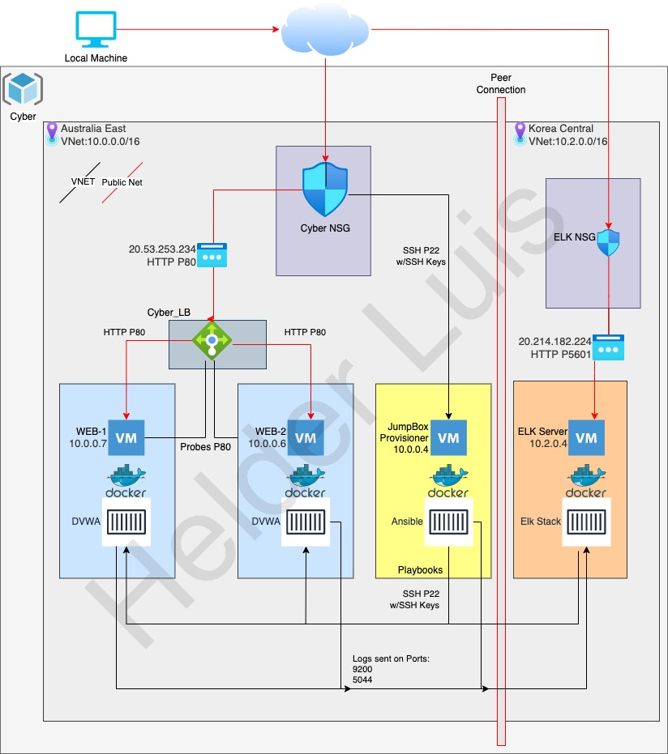
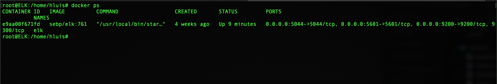

## Automated ELK Stack Deployment

The files in this repository were used to configure the network depicted below.

These files have been tested and used to generate a live ELK deployment on Azure. They can be used to either recreate the entire deployment pictured above. Alternatively, select portions of the YAML file may be used to install only certain pieces of it, such as Filebeat.

  - _[ELK YAML File ](Ansible/filebeat-playbook.yml)_

This document contains the following details:
- Description of the Topologu
- Access Policies
- ELK Configuration
  - Beats in Use
  - Machines Being Monitored
- How to Use the Ansible Build

### Description of the Topology

The main purpose of this network is to expose a load-balanced and monitored instance of DVWA, the Damn Vulnerable Web Application.

Load balancing ensures that the application will be highly available, in addition to restricting in-bound to the network.

 - Load Balance plays an important security role by off-loading distributed denial-of-service (DDoS) attacks
 - Implementing the use of a Jump Box its possible secure the connection before launching any administrative tasks or even to connect to other serveres

Integrating an ELK server allows users to easily monitor the vulnerable VMs for changes to the data and system logs.
- What does Filebeat watch for?
  - Filebeat monitors the log files or specific locations that you can select, collects log events and forwards to the Logstash or Elasticsearch for indexing. 

- What does Metricbeat record?
  - Meatricbeat collects metrics from the operating system and from the services running on the server and sends it to the Elastichsearch or Logstash.
   
The configuration details of each machine may be found below.

| Name       | Function   | Private IP |  Public IP         | Operating System |
|------------|------------|------------|--------------------|------------------|
| Jump Box   | Gateway    | 10.0.0.4   |                    | Linux            |
| Web-1      | Web Server | 10.0.0.7   |                    | Linux            |
| Web-2      | Web Server | 10.0.0.6   |                    | Linux            |
| Elk-Server | Monitoring | 10.2.0.4   | 20.196.215.10:5601 | Linux            |

### Access Policies

The machines on the internal network are not exposed to the public Internet. 

Only the Jum-Box-Provisioner machine can accept connections from the Internet. Access to this machine is only allowed from the following IP addresses:

- White List:   
  - 184.144.115.191 

Machines within the network can only be accessed by Jump-Bpx-Provisioner.
- Which machine did you allow to access your ELK VM? What was its IP address?
  - The only machine allowed to access the ELK VM is the Jump-Box configured with the IP address of 10.0.0.4 
  

A summary of the access policies in place can be found in the table below.

| Name     | Publicly Accessible | Allowed IP Addresses |
|----------|---------------------|----------------------|
| Jump Box | Yes                 | 184.144.115.191      |
| Web 1 VM | No                  | 10.0.0.4             |
| Web 2 VM | No                  | 10.0.0.4             |
| ELK VM   | No                  | 10.0.0.4             |

### Elk Configuration 
  - _[ELK Install YAML](Linux/install_elk.yml)_

Ansible was used to automate configuration of the ELK machine. No configuration was performed manually, which is advantageous because...
- What is the main advantage of automating configuration with Ansible?
  - The main advantages of automating configuration with ansible is reducing time and configurations on deploying systems, limiting the number of tasks and simplicity.
  
  
The playbook implements the following tasks:
- In 3-5 bullets, explain the steps of the ELK installation play. E.g., install Docker; download image; etc._
  - First I, SSH into the Jump-Box-Provisioner (ssh hluis@40.117.224.154)
  - Start/Attached to the ansible docker (sudo docker start sweet_sinoussi)/(sudo docker attach sweet_sinoussi)
  - Went to /etc/ansible/ directory and created the ELK playbook (Elk_Playbook.yml)
  - Ran the Elk_Playbook.yml in that same directory (ansible-playbook Elk_Playbook.yml)
  - Lastly, I SSH into the ELK-VM to verify the server is up and running.
   
  

The following screenshot displays the result of running `docker ps` after successfully configuring the ELK instance.

### Target Machines & Beats
This ELK server is configured to monitor the following machines:
- WEB-1: 10.0.0.7
- WEB-2: 10.0.0.6

We have installed the following Beats on these machines:

- Filebeats
  - _[Filebeats Config Playbook](Ansible/filebeat-config.yml)_
  - _[Filebeats Playbook](Ansible/filebeat-playbook.yml)_
  
- Meatricbeats
  - _[Meatricbeats Config Playbook](Ansible/metricsbeat-config.yml)_
  - _[Meatricbeats Playbook](Ansible/metricsbeat-playbook.yml)_

These Beats allow us to collect the following information from each machine:
 
  - From Metricbeats we are able to collect data such as CPU, Memory, Network Traffic. With the Network Traffic data we can use it to determin spikes of use that can determin DDOS atacks, or possible data exportation. 

  - From Filebeats, we are able to collect data such as Syslogs, SSH logins, Sudo commands. With the Sudo commands data we can use it to determin attemps of logins,  privilege escalation 
  

### Using the Playbook
In order to use the playbook, you will need to have an Ansible control node already configured. Assuming you have such a control node provisioned: 

SSH into the control node and follow the steps below:
- Copy the _____ file to _____.
- Update the _[host](Ansible/hosts)_ file to include the Web Servers IP's and ELK Server IP
- Run the playbook, and navigate to ____ to check that the installation worked as expected.

_TODO: Answer the following questions to fill in the blanks:_
- _Which file is the playbook? Where do you copy it?_
- _Which file do you update to make Ansible run the playbook on a specific machine? How do I specify which machine to install the ELK server on versus which to install Filebeat on?_
- _Which URL do you navigate to in order to check that the ELK server is running?

_As a **Bonus**, provide the specific commands the user will need to run to download the playbook, update the files, etc._
